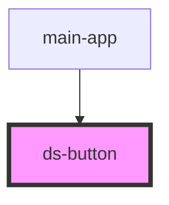

# ds-button

<!-- Auto Generated Below -->

## Properties

| Property     | Attribute     | Description | Type                             | Default     |
| ------------ | ------------- | ----------- | -------------------------------- | ----------- |
| `buttonText` | `button-text` |             | `string`                         | `undefined` |
| `variant`    | `variant`     |             | `"outline" \| "solid" \| "text"` | `'solid'`   |

## Dependencies

### Used by

 - [main-app](../main-app)

### Graph

----------------------------------------------

*Built with [StencilJS](https://stenciljs.com/)*
